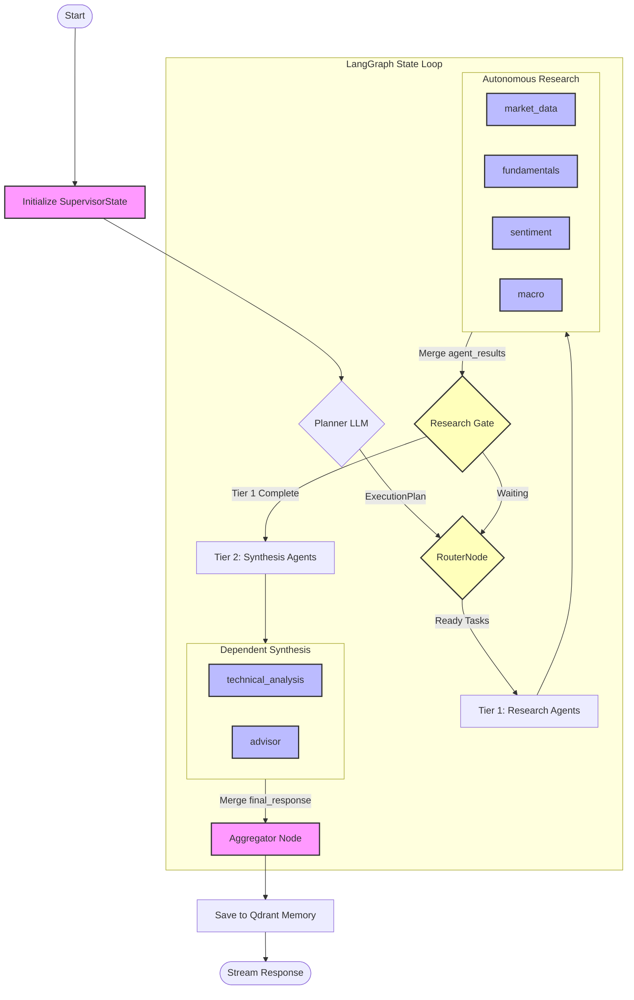
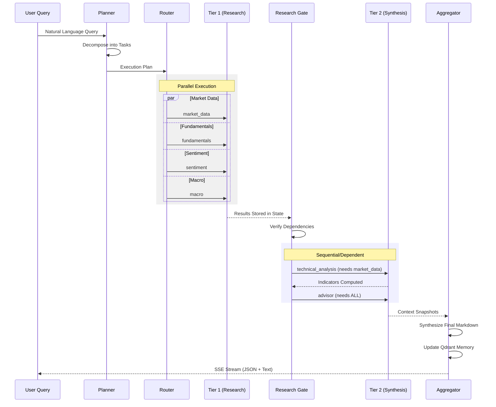

# AI Stock Assistant

A production-grade, research-first stock analysis platform powered by a **LangGraph multi-agent supervisor**, **Claude (Anthropic)**, and real-time market data from Schwab and Alpaca. The system routes natural language queries through a dependency-aware agent graph, generates institutional-quality research reports, and streams results to a Next.js UI in real time.

---

## Table of Contents

1. [What It Does](#what-it-does)
2. [Tech Stack](#tech-stack)
3. [High-Level Architecture](#high-level-architecture)
4. [Agentic Pattern — LangGraph Supervisor](#agentic-pattern--langgraph-supervisor)
5. [Sub-Agents In Detail](#sub-agents-in-detail)
6. [Report Engine](#report-engine)
7. [Data Layer](#data-layer)
8. [Observability](#observability)
9. [Repository Layout](#repository-layout)
10. [Quick Start](#quick-start)
11. [Environment Variables](#environment-variables)
12. [Trading Safety](#trading-safety)
13. [Test Suite](#test-suite)

---

## What It Does

- **Chat interface** — ask any financial question in natural language. The supervisor graph decomposes it into parallel research tasks, runs specialist agents, and streams a synthesized answer back.
- **Report Lab** — generate 10 institutional-style research reports (Goldman Screener, Morgan DCF, Bridgewater Risk, Citadel Technical, etc.) on any ticker or sector.
- **Live market data** — real-time quotes, OHLCV history, analyst ratings, insider trades, SEC filings, Reddit/news sentiment, and FRED macroeconomic data.
- **Portfolio + trading** — Schwab integration with a mandatory human-in-the-loop (HITL) gate before any order is submitted.
- **Memory** — conversation history stored in Qdrant (vector DB) for semantic recall across sessions.

---

## Tech Stack

| Layer | Technology |
|---|---|
| **Frontend** | Next.js 14, TypeScript, Tailwind CSS, Server-Sent Events (SSE) |
| **Backend** | FastAPI, Python 3.12, asyncio, Uvicorn |
| **Agent Framework** | LangGraph (StateGraph), LangChain |
| **LLM** | Anthropic Claude (`claude-3-5-sonnet-latest`, `claude-3-haiku`) |
| **Market Data** | Schwab API (primary), Alpaca API (fallback) |
| **Alt Data** | Finviz (fundamentals/screener), FRED (macro), Reddit/PRAW, Tavily (web search) |
| **Cache** | Redis (module-level singleton connection pool) |
| **Database** | PostgreSQL via `asyncpg` (portfolio, threads, alerts) |
| **Vector Store** | Qdrant (conversation memory, semantic search) |
| **Observability** | MLflow (experiment tracking, run traces) |
| **Testing** | Python `unittest` (108 tests, zero LLM calls) |

---

## Agentic Architecture

The system follows a **Hierarchical Multi-Agent Orchestration (HMAO)** pattern. Unlike simple chain-of-thought, it decouples **Planning** from **Execution** and **Synthesis**.

### Agent Taxonomy & Design Patterns

We classify our agents into four distinct patterns based on their cognitive load and autonomy:

| Pattern | Agent Type | Description | Cognitive Model |
|---|---|---|---|
| **Orchestrator** | `Supervisor` | Manages the `ExecutionPlan`, routes tasks, and maintains shared `SupervisorState`. | State-Machine / Router |
| **ReAct Researcher** | `Fundamentals`, `Sentiment` | Autonomous agents that use recursive tool loops to solve open-ended research questions. | Multi-turn Reasoning (ReAct) |
| **Functional Specialist** | `Market Data`, `Aggregator` | High-reliability, deterministic agents that perform direct API calls or data normalization. | Static / Zero-LLM |
| **Synthesis Advisor** | `Technical`, `Advisor` | "Top-tier" agents that do not fetch raw data but use the `agent_results` of others to form judgments. | Context-Aware Reasoning |

---

```mermaid
graph TD
    User([User])
    
    subgraph Frontend [apps/web - Next.js]
        Web[Web UI]
        Proxy[/api/py/* Proxy]
    end

    subgraph Backend [apps/api - FastAPI]
        Gateway["FastAPI Gateway<br/>(Gateway / Stream)"]
        
        subgraph Agents [LangGraph Multi-Agent System]
            Supervisor[StateGraph Supervisor]
            Planner[Planner LLM]
            Router[Pure Python Router]
            
            subgraph ResearchTier [Tier 1: Parallel Research]
                MD[Market Data]
                FU[Fundamentals]
                SE[Sentiment]
                MA[Macro]
            end
            
            subgraph SynthesisTier [Tier 2: Synthesis]
                TA[Technical Analysis]
                AD[Advisor]
            end
            
            Aggregator[Aggregator / Memory]
        end
        
        subgraph Engine [Specialist Engine]
            RE[Report Engine Orchestrator]
            Builders[10 Report Builders]
        end
    end

    subgraph Data [Data Layer]
        Redis[(Redis Cache)]
        Postgres[(PostgreSQL)]
        Qdrant[(Qdrant Memory)]
    end

    subgraph Providers [External APIs]
        Schwab[Schwab API]
        Alpaca[Alpaca API]
        FRED[FRED]
        Reddit[Reddit / Tavily]
    end

    %% Interactions
    User --> Web
    Web --> Proxy
    Proxy --> Gateway
    
    Gateway --> Supervisor
    Gateway --> RE
    
    Supervisor --> Planner
    Planner --> Router
    Router --> ResearchTier
    ResearchTier --> Gate{Gate}
    Gate --> SynthesisTier
    SynthesisTier --> Aggregator
    
    RE --> Builders
    
    %% Data Flow
    Agents & Engine --> Redis
    Agents & Engine --> Postgres
    Agents & Engine --> Qdrant
    
    Redis & Postgres & Qdrant --> Providers
```

---

---

## Agentic Pattern — LangGraph Supervisor

The core of the system is a **two-tier LangGraph StateGraph** with a dependency-aware task planner.

### Agentic Architecture

This diagram illustrates how the Supervisor manages the shared state and orchestrates autonomous specialist agents based on the dynamic execution plan.



### State

Every graph invocation carries a `SupervisorState` TypedDict:

```python
class SupervisorState(TypedDict):
    messages:        Annotated[list, add_messages]   # append-only
    user_id:         str
    tenant_id:       str
    conversation_id: str
    plan:            ExecutionPlan                   # set by planner
    task_status:     Annotated[dict, merge_dicts]    # parallel-safe
    agent_results:   Annotated[dict, merge_dicts]    # parallel-safe
    memory_context:  list                            # injected from Qdrant
    final_response:  str                             # set by aggregator
```

`task_status` and `agent_results` use a `merge_dicts` reducer so parallel agent nodes can write concurrently without overwriting each other.

### Graph Nodes & Flow



### Execution Plan Example

For the query *"Analyze AAPL and give me a buy/sell recommendation"*, the planner produces:

```python
ExecutionPlan(
  steps=[
    AgentTask(task_id="t1", agent="market_data",        depends_on=[]),
    AgentTask(task_id="t2", agent="fundamentals",       depends_on=[]),
    AgentTask(task_id="t3", agent="sentiment",          depends_on=[]),
    AgentTask(task_id="t4", agent="technical_analysis", depends_on=["t1"]),
    AgentTask(task_id="t5", agent="advisor",            depends_on=["t1","t2","t3","t4"]),
  ]
)
```

Execution timeline:

```
t=0s   t1, t2, t3 start in parallel
t=2s   t1 (market_data) completes
t=4s   t2, t3 complete → research_gate opens
t=4s   t4 (technical_analysis) starts (t1 done)
t=6s   t4 completes
t=6s   t5 (advisor) starts (all deps done)
t=9s   t5 completes → aggregator → response
```

**Wall-clock: ~9s** vs ~18s sequential.

### Task Status Lifecycle

```
pending → completed
        → failed
        → skipped  (dependency failed/skipped)
```

The Router uses **Dependency Injection** logic to determine readiness: a task is only dispatched if all `depends_on` IDs are in the `completed` state within the global `task_status` dictionary.

---

## Sub-Agents In Detail

The system uses a **Federated Intelligence** model where sub-agents are specialists with restricted tool-scopes. This prevents "context poisoning" where an agent gets distracted by irrelevant data.

### 1. `market_data` — Pure Data Fetcher

```
Pattern:  Direct tool invocation (NO LLM)
Provider: Schwab (primary) → Alpaca (fallback)
Tools:    get_unified_quote, get_unified_history,
          get_company_profile, get_market_movers, get_news

Output:
  quotes:   {AAPL: {price, change, volume, ...}}
  history:  {AAPL: [{date, open, high, low, close, volume}, ...]}
  profiles: {AAPL: {sector, industry, description, ...}}
  news:     [{headline, source, url, sentiment}, ...]

Special:
  - Multi-symbol detection → correlation table
  - Staleness check (_is_history_stale) → triggers Alpaca fallback
  - Batch quote fetch (get_unified_quotes) avoids N+1 calls
```

### 2. `fundamentals` — Company Research

```
Pattern:  AsyncAnthropic tool-use loop (ReAct, up to 5 iterations)
Provider: Finviz, Schwab news
Tools:    get_analyst_ratings, get_insider_trades,
          get_company_overview, get_news_sentiment,
          get_sec_filings, get_earnings_history

LLM loop:
  1. Claude receives tools + query
  2. Claude calls tools (parallel where possible)
  3. Tool results fed back to Claude
  4. Claude produces synthesis text
  5. Loop exits when no tool call in response

Output:
  overview:  {P/E, margins, debt/equity, moat rating}
  ratings:   [{analyst, firm, rating, target}, ...]
  insiders:  [{name, role, action, shares, date}, ...]
  earnings:  [{quarter, EPS_actual, EPS_estimate, surprise}, ...]
```

### 3. `sentiment` — Social & News Sentiment

```
Pattern:  AsyncAnthropic tool-use loop (same as fundamentals)
Provider: Reddit (PRAW), Tavily (web search), Quiver Quant
Tools:    get_reddit_sentiment, get_news_sentiment,
          get_congressional_trades, search_web

Output:
  reddit:        {mentions, sentiment_score, top_posts}
  news:          {sentiment_score, headline_count, sources}
  congressional: [{member, party, action, ticker, date}, ...]

Symbol extraction uses content_utils.extract_symbols():
  - $TICKER notation takes precedence
  - Stop-word list filters out SEC, EPS, GDP, AI, etc.
```

### 4. `macro` — Macroeconomic Context

```
Pattern:  LangChain ChatAnthropic with tool binding
Provider: FRED (Federal Reserve Economic Data)
Tools:    get_key_indicators, get_series_data, search_series

Optimization:
  - _SERIES_METADATA dict hardcodes title+units for 7 known series
  - Eliminates second HTTP call to /fred/series per indicator
  - asyncio.gather() fetches all 5 key indicators in parallel

Output:
  gdp, cpi, unemployment, fed_funds, 10y_treasury, 2y_treasury
  Each: {value, date, title, units}
```

### 5. `technical_analysis` — Chart Analysis

```
Pattern:  LangChain ChatAnthropic with tool binding
Depends:  market_data (enforced by research_gate)
Tools:    Reads from agent_results["market_data"] first,
          falls back to get_unified_history

Indicators computed in pure Python:
  RSI, MACD, Bollinger Bands, Fibonacci retracements,
  support/resistance levels, volume profile

Output:
  signal:     "buy" | "sell" | "neutral"
  confidence: float (0-1)
  rsi, macd, bollinger, fibonacci, support, resistance
```

### 6. `advisor` — Final Synthesis

```
Pattern:  LangChain ChatAnthropic React agent (most complex)
Depends:  ALL other agents (runs last)
Tools:    market_context_snapshot, get_unified_quote,
          get_unified_history, get_news

Context injection (_build_specialist_context):
  ├── market_data  → price, volume, 52w range
  ├── fundamentals → P/E, margins, analyst ratings
  ├── technical    → RSI, MACD, signal, support/resistance
  ├── sentiment    → reddit score, news sentiment
  └── macro        → GDP, CPI, fed funds rate

Output:
  recommendation: "buy" | "sell" | "hold" | "watch"
  conviction:     "high" | "medium" | "low"
  price_target:   float
  stop_loss:      float
  time_horizon:   "short" | "medium" | "long"
  narrative:      full evidence-based markdown response
```

### Agent Comparison

| Agent | LLM | Pattern | Avg Latency | Depends On |
|---|---|---|---|---|
| `market_data` | ❌ | Direct tool call | ~0.5s | None |
| `fundamentals` | ✅ | AsyncAnthropic tool-use loop | ~2–4s | None |
| `sentiment` | ✅ | AsyncAnthropic tool-use loop | ~2–3s | None |
| `macro` | ✅ | LangChain ChatAnthropic | ~1–2s | None |
| `technical_analysis` | ✅ | LangChain ChatAnthropic | ~1–2s | `market_data` |
| `advisor` | ✅ | LangChain React agent | ~3–5s | All |

---

## Report Engine

When the user requests a named report (e.g. *"Run a Goldman Screener for AAPL"*), the system **bypasses the agent graph** and goes directly to the Report Engine — a faster, deterministic path.

### Detection

`stream.py → _detect_report_request()` uses regex to identify report requests and extract parameters (ticker, sector, symbols).

### 10 Report Types

| Report | Builder | Description |
|---|---|---|
| `goldman_screener` | `build_goldman_screener` | Multi-factor stock screener with moat + risk scoring |
| `morgan_dcf` | `build_morgan_dcf` | Discounted cash flow valuation with bull/base/bear scenarios |
| `bridgewater_risk` | `build_bridgewater_risk` | Portfolio risk analysis with correlation matrix |
| `jpm_earnings` | `build_jpm_earnings` | Earnings quality + surprise analysis |
| `citadel_technical` | `build_citadel_technical` | Technical analysis with Fibonacci + support/resistance |
| `harvard_dividend` | `build_harvard_dividend` | Dividend safety scoring + yield analysis |
| `bain_competitive` | `build_bain_competitive` | Competitive moat analysis across sector peers |
| `renaissance_pattern` | `build_renaissance_pattern` | Quantitative pattern recognition |
| `blackrock_builder` | `build_blackrock_builder` | Portfolio construction + factor exposure |
| `mckinsey_macro` | `build_mckinsey_macro` | Macro environment + sector impact analysis |

### Report Pipeline

```mermaid
graph LR
    Req[Report Request] --> Det{Detection}
    Det -->|Regex Match| Orch[Orchestrator]
    Orch --> Prompt[Prompt Selection]
    Prompt --> Build[Report Builders]
    
    subgraph Builders [10 Specialist Builders]
        GS[Goldman Screener]
        MD[Morgan DCF]
        BR[Bridgewater Risk]
        JP[JPM Earnings]
        CT[Citadel Technical]
        HD[Harvard Dividend]
        BC[Bain Competitive]
        RP[Renaissance Pattern]
        BB[Blackrock Builder]
        MM[McKinsey Macro]
    end
    
    Build --> Quality{Quality Gate}
    Quality -->|Pass > 0.75| Synth[Synthesizer]
    Quality -->|Low Score| Repair[Auto-Repair Agent]
    Repair --> Synth
    
    Synth --> Trace[MLflow Tracking]
    Synth --> DB[(PostgreSQL)]
    Synth --> User([Final Markdown])
```



### Quality Gate

Reports are scored across 7 checks:

```python
checks = {
    "has_markdown":        len(markdown) > 120,
    "has_sources":         len(sources) > 0,
    "has_tool_plan":       len(tool_plan) > 0,
    "has_assumptions":     len(assumptions) > 0,
    "has_limitations":     len(limitations) > 0,
    "mentions_report_type": report_type in markdown,
    "mentions_ticker":     ticker in markdown,
}
score = weighted_sum(checks)  # 0.0 – 1.0
```

Reports below 0.75 are auto-repaired before being returned.

---

## Data Layer

### Market Data Provider

`apps/api/services/market_data_provider.py` is the unified interface for all price data:

```
get_unified_quote(symbol)
get_unified_quotes(symbols)   ← batch, avoids N+1
get_unified_history(symbol, days)
get_company_profile(symbol)
get_market_movers()
get_news(symbol)

Strategy:
  1. Check Redis cache (TTL-based)
  2. Try Schwab API
  3. If stale or error → fallback to Alpaca
  4. Normalize to common schema
  5. Write back to cache
```

### Redis Cache (Singleton)

`apps/api/services/cache.py` — one connection pool for the entire process:

```python
# Initialized once at startup via lifespan
await init_cache()

# Used everywhere via get_cache() or cache_get_or_fetch()
cache = get_cache()
await cache.get(key)
await cache.set(key, value, ttl=60)
```

TTL map:

| Data Type | TTL |
|---|---|
| `quote` | 15 seconds |
| `price_history` | 1 hour |
| `analyst_ratings` | 1 day |
| `economic_data` | 1 hour |
| `news` | 5 minutes |
| `reddit_sentiment` | 5 minutes |

### PostgreSQL Schema

| Table | Purpose |
|---|---|
| `holdings` | Portfolio positions |
| `transactions` | Trade history |
| `watchlists` | User watchlists |
| `alerts` | Price/event alerts |
| `report_threads` | Report conversation threads |
| `report_thread_messages` | Per-thread message history |

### Qdrant (Vector Memory)

`apps/api/agents/memory/manager.py` — `MemoryManager` is a module-level singleton:

```python
# Saves after every aggregator run
await memory_manager.save_interaction(
    user_input=query,
    agent_output=response,
    metadata={conversation_id, user_id, tenant_id}
)

# Recalled by planner for context injection
context = await memory_manager.recall(query, user_id=user_id)
```

---

## Observability

### MLflow

Two experiments are tracked:

- **`ai-stock-assistant-chat`** — every chat invocation: model, tokens, latency, agent trace
- **`ai-stock-assistant-reports`** — every report run: type, ticker, quality score, generation time

```bash
# View MLflow UI
./.venv/bin/mlflow ui --backend-store-uri file:./mlruns --host 127.0.0.1 --port 5001
```

### In-App Decision Trace

The SSE stream emits structured trace events in real time:

```json
{"type": "planner",   "data": {"steps": [...], "reasoning": "..."}}
{"type": "agent_start","data": {"agent": "market_data"}}
{"type": "tool_call",  "data": {"tool": "get_unified_quote", "symbol": "AAPL"}}
{"type": "agent_done", "data": {"agent": "market_data", "ms": 480}}
{"type": "final",      "data": {"response": "..."}}
```

These power the live Decision Trace panel in the chat UI.

---

## Repository Layout

```
ai-stock-assistant/
├── apps/
│   ├── api/                          FastAPI backend
│   │   ├── agents/
│   │   │   ├── supervisor/           LangGraph graph, planner, router, state
│   │   │   │   ├── graph.py          ← Two-tier StateGraph (main entry point)
│   │   │   │   ├── planner.py        ← ExecutionPlan generation (AsyncAnthropic)
│   │   │   │   ├── state.py          ← SupervisorState, ExecutionPlan, AgentTask
│   │   │   │   └── task_runtime.py   ← deps_satisfied, canonical_agent, merge_queries
│   │   │   ├── market_data/          Tool-only data fetcher
│   │   │   ├── fundamentals/         AsyncAnthropic tool-use loop
│   │   │   ├── sentiment/            AsyncAnthropic tool-use loop
│   │   │   ├── macro/                LangChain + FRED
│   │   │   ├── technical_analysis/   LangChain + indicators
│   │   │   ├── advisor/              LangChain React agent
│   │   │   ├── memory/               MemoryManager (Qdrant singleton)
│   │   │   └── content_utils.py      normalize_content_to_text, extract_symbols
│   │   ├── gateway/
│   │   │   ├── main.py               FastAPI app + lifespan + CORS
│   │   │   ├── stream.py             SSE chat + report detection
│   │   │   └── routers/              market_data, reports, schwab, tooling
│   │   ├── services/
│   │   │   ├── cache.py              Redis singleton + cache_get_or_fetch
│   │   │   ├── market_data_provider.py  Schwab/Alpaca unified interface
│   │   │   ├── report_engine.py      10 report builders + shared math helpers
│   │   │   ├── report_orchestrator.py   Quality gate + thread management
│   │   │   ├── report_synthesizer.py    Markdown formatting
│   │   │   ├── finviz_client.py      Finviz scraper (Semaphore-limited)
│   │   │   ├── fred_client.py        FRED API + hardcoded metadata
│   │   │   ├── mlflow_tracker.py     MLflow logging
│   │   │   └── ...
│   │   ├── db/                       asyncpg repos (portfolio, threads, alerts)
│   │   ├── config.py                 Settings (env vars, ALLOWED_ORIGINS, models)
│   │   └── tests/                    108 unit tests (zero LLM calls)
│   └── web/                          Next.js 14 frontend
├── scripts/                          Report tests, stress tests, edge case tests
├── docs/                             Architecture, Schwab API, Operations docs
└── README.md                         ← You are here
```

---

## Quick Start

### 1. Install dependencies

```bash
# Backend
poetry install

# Frontend
cd apps/web && npm install
```

### 2. Configure environment

```bash
cp .env.example .env
# Edit .env with your API keys
```

### 3. Start services

```bash
# Redis (required)
redis-server

# PostgreSQL (required)
# Qdrant (required for memory)
docker run -p 6333:6333 qdrant/qdrant
```

### 4. Run backend

```bash
./.venv/bin/python -m uvicorn apps.api.gateway.main:app --host 127.0.0.1 --port 8001 --reload
```

### 5. Run frontend

```bash
cd apps/web && npm run dev
```

### 6. Run MLflow UI (optional)

```bash
./.venv/bin/mlflow ui --backend-store-uri file:./mlruns --host 127.0.0.1 --port 5001
```

### Key URLs

| Service | URL |
|---|---|
| Chat | `http://127.0.0.1:3001/` |
| Report Lab | `http://127.0.0.1:3001/reports` |
| Schwab Integration | `http://127.0.0.1:3001/integrations/schwab` |
| API Health | `http://127.0.0.1:8001/health` |
| Tool Contracts | `http://127.0.0.1:8001/api/tools/contracts` |
| MLflow UI | `http://127.0.0.1:5001` |

---

## Environment Variables

| Variable | Required | Description |
|---|---|---|
| `CLAUDE_API_KEY` | ✅ | Anthropic API key |
| `SCHWAB_MARKET_CLIENT_ID` | ✅ | Schwab market data app ID |
| `SCHWAB_MARKET_CLIENT_SECRET` | ✅ | Schwab market data app secret |
| `SCHWAB_MARKET_TOKEN_PATH` | ✅ | Path to Schwab OAuth token JSON |
| `REDIS_URL` | ✅ | Redis connection URL (default: `redis://localhost:6379/0`) |
| `DATABASE_URL` | ✅ | PostgreSQL asyncpg URL |
| `QDRANT_HOST` | ✅ | Qdrant host (default: `localhost`) |
| `FRED_API_KEY` | ⚡ | FRED API key (macro reports) |
| `TAVILY_API_KEY` | ⚡ | Tavily web search (sentiment agent) |
| `REDDIT_CLIENT_ID` | ⚡ | Reddit API (sentiment agent) |
| `REDDIT_CLIENT_SECRET` | ⚡ | Reddit API secret |
| `ALPACA_API_KEY` | ⚡ | Alpaca fallback market data |
| `ALPACA_SECRET_KEY` | ⚡ | Alpaca secret |
| `ALLOWED_ORIGINS` | 🔒 | Comma-separated CORS origins (default: localhost:3000,3001) |
| `ENABLE_LIVE_TRADING` | 🔒 | `false` by default — must be explicit to enable |
| `REQUIRE_HITL_FOR_TRADES` | 🔒 | `true` by default — HITL gate for all orders |
| `MLFLOW_ENABLED` | 📊 | Enable MLflow tracking (default: `true`) |
| `LANGSMITH_API_KEY` | 📊 | LangSmith tracing (optional) |

---

## Trading Safety

Live trading is **disabled by default** and requires explicit opt-in:

```bash
ENABLE_LIVE_TRADING=true
REQUIRE_HITL_FOR_TRADES=true   # always keep this true
HITL_SHARED_SECRET=<secret>    # required for HITL approval endpoint
```

The HITL flow:
1. Advisor agent proposes an order
2. Order is previewed and returned to the user for approval
3. User approves via `/api/schwab/hitl/approve` with the shared secret
4. Only then is the order submitted to Schwab

---

## Test Suite

```bash
./.venv/bin/python -m unittest discover -s apps/api/tests -p "test_*.py" -v
```

**108 tests, 0 failures, 0 LLM calls.**

| Test File | Coverage |
|---|---|
| `test_supervisor_graph.py` | `canonical_agent`, `deps_satisfied`, `get_ready_tasks_for_agent`, tier sets, `_ready_agents_from_tier` |
| `test_market_data_provider.py` | `_is_history_stale`, `_map_days_to_schwab_period`, `_normalize_history` |
| `test_report_engine_helpers.py` | `_safe_float`, `_safe_pct`, `_moat_rating`, `_risk_score`, `_daily_returns`, `_correlation`, `_fmt_num`, `_fmt_pct` |
| `test_report_synthesizer.py` | Synthesizer output contract, follow-up labels, limitation notes |
| `test_report_orchestrator.py` | Quality gate, trace structure |
| `test_reports_api.py` | Report API endpoints, template CRUD |
| `test_schwab_router.py` | HITL flow, order preview, live trading gate |

---

## Documentation Index

- [`docs/ARCHITECTURE.md`](docs/ARCHITECTURE.md) — detailed component diagrams
- [`docs/SCHWAB_API_REFERENCE.md`](docs/SCHWAB_API_REFERENCE.md) — Schwab OAuth + endpoints
- [`docs/OPERATIONS.md`](docs/OPERATIONS.md) — deployment, monitoring, runbooks
- [`docs/archive/`](docs/archive/) — historical planning and progress docs
